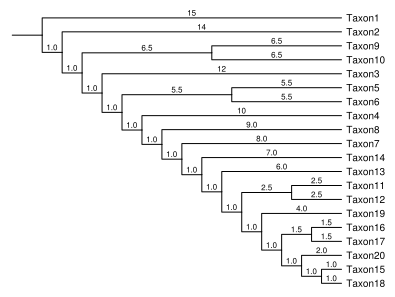

# TreeViewer

<p align="center">
    
</p>

## Introduction

**TreeViewer** is a cross-platform program to draw phylogenetic trees. It is based on a "modular" approach, in which small _modules_ are used to perform individual actions (such as computing the coordinates of the nodes of the tree, or drawing the tree branches) that together contribute to the final plot.

Each TreeViewer module has a user manual, and these can be displayed in TreeViewer by opening the `Module Manager` window (from the `Edit` menu) or by clicking on the various question mark (`?`) icons that are shown throughout the program when appropriate.

TreeViewer is written using .NET 5 and is available for Windows, macOS and Linux operating systems. It consists of the main GUI program and a command-line utility that can be used to plot trees that are too large to be previewed on-screen in real time. It is licensed under a GNU Affero GPLv3 license.

## Installing TreeViewer

The easiest way to start using TreeViewer is to install the program using the installer for your operating system.

### Windows

Download [`TreeViewer-Win-x64.msi`](https://github.com/arklumpus/TreeViewer/releases/latest/download/TreeViewer-Win-x64.msi) and double-click it (if you get a Windows Defender SmartScreen warning, click on `More info` and choose `Run anyway`). The installer will guide you through the process, and will do four main things:

1. Copy the program files (by default in C:\Program Files).
2. Delete any downloaded modules from previous versions of TreeVIewer.
3. Add the installation path to the PATH environment variable (so that you can recall TreeViewer from the command line, wherever you are located).
4. Add a shortcut to TreeViewer to the Start Menu.

Of course, 3 and 4 are optional, and you can decide to skip these steps during the installation.

You can now run TreeViewer using the shortcut that has been created. Alternatively, you can invoke the program from the command line by typing `TreeViewer` in the command prompt (which you can open by pressing `Win+R` on your keyboard, typing `cmd` and pressing Enter). You can also run the command-line version by typing `TreeViewerCommandLine`.

### macOS

Installing TreeViewer on macOS is slightly more complicated, due to the draconian security policies enforced by Apple (essentially, unless developers pay 99$ to Apple every year, macOS will refuse to trust them).

Download [`TreeViewer-Mac-x64.pkg`](https://github.com/arklumpus/TreeViewer/releases/latest/download/TreeViewer-Mac-x64.pkg). Right-click/Ctrl+click it and select `Open`. You should get a warning dialog about the developer not being identified; ignore it and click `Open` in the dialog. The installer should open and guide you through the process. It will do three main things:

1. Copy the TreeViewer app to the `/Applications` folder.
2. Delete any downloaded modules from previous versions of TreeVIewer.
3. Create symlinks to the TreeViewer executables (`TreeViewer` and `TreeViewerCommandLine`) in the `/usr/local/bin` folder.

**Note**: after downloading the installer, you _have to_ right-click or ctrl+click it, otherwise (as per the Apple security policy above), macOS will refuse to let you open it.

Once the installer is finished, you can run TreeViewer by opening the App in your Applications folder. You can also run it from the command line by typing `TreeViewer` (or `TreeViewerCommandLine` for the command line version) in a terminal window.

TreeViewer has been tested on macOS Catalina and Big Sur.

### Linux

TreeViewer has been tested on Debian buster, Ubuntu 20.04 and 20.10, Linux Mint 20.1, openSUSE Leap 15.2, Fedora 33, and CentOS 7 and 8.

Open a terminal window and download the installer using `wget` or `curl` (whichever you prefer/have available):

```bash
wget https://github.com/arklumpus/TreeViewer/releases/latest/download/TreeViewer-Linux-x64.run
```

(To use `curl`, replace `wget` with `curl -LO`). Make the downloaded file executable and execute it as root:

```bash
chmod +x TreeViewer-linux-x64.run
sudo "./TreeViewer-linux-x64.run"
```

Depending on your system, you may have to replace `sudo` with `su -c`. You should be prompted for the super-user password. The installer will:

1. Copy the TreeViewer files to `/usr/lib/TreeViewer` (this can be changed)
2. Delete any downloaded modules from previous versions of TreeViewer.
3. Create symlinks to the `TreeViewer` and `TreeViewerCommandLine` executables in `/usr/bin` (this step can be skipped).
4. Add TreeViewer to the Desktop menu (this step can be skipped, but it is highly advised not to skip it, unless you are installing TreeViewer on a headless server without a desktop environment).

You can now open TreeViewer using the icon that has been added to the desktop menu, or by typing `TreeViewer` (or `TreeViewerCommandLine` for the command-line version) in the command line.

## Getting started

The first time you open TreeViewer after installing it, you will be greeted by a welcome window that will allow you to install the latest version of all the available modules. It is advised to install all the available modules, otherwise some actions may not be available in the program.

After this step is completed, on **Windows** and **Linux** a new window will open, asking you with which extensions you wish to associate TreeViewer. Choose the files that you would like to open with TreeViewer and click OK to create the file associations (on Windows, you may have to click on the "shield" button to execute this step as an administrator: when you do this, the program will restart after showing an elevation prompt and go straight to the file association window).

On **macOS**, file associations work differently: the file extensions supported by TreeViewer will automatically be associated with the program, unless you have another program that is already associated with them. You will also need to grant permission to TreeViewer to open files from anywhere on your computer; a window will open with [detailed instructions on how to do this](src/TreeViewer/Assets/MacOSPermissionsInstructions.md).

After these preliminary operations have been completed, the main TreeViewer window should open.

To verify that everything is working correctly, you can download and open the [`test.tbi`](test.tbi) file. You should get a warning about the file containing source code: this is a security feature, as files coming from unknown sources may contain malicious code. Whenever you open a file that has not been created by you, you will get a warning like this; however, you can choose to permanently trust the creator of the file, and in this way you will not get prompted again if you open another file that has been created by the same user.

After granting the file permission to load and compile the source code, you should get a plot similar to the one below:

<p align="center">
    
</p>

## Troubleshooting and known issues

* On some Linux distributions, the file icons sometimes don't show up for some file types. This appears to be dependent on the file manager used by each distro, so unfortunately there is not much that we can do. Strangely enough, even though the custom icon is not shown, double clicking the files should still work and open them in TreeViewer.

* On macOS you may get two (or more) TreeViewer icons in the section of your dock that holds recently open applications. This is due to the way that macOS handles opening files, which is not fully supported by the Avalonia framework that TreeViewer uses for its UI (see [https://github.com/AvaloniaUI/Avalonia/discussions/5504](https://github.com/AvaloniaUI/Avalonia/discussions/5504)).

* On macOS, if after double-clicking a tree file or dragging it on the TreeViewer icon on the dock you get a message about the file not being supported by the installed modules, it may be due to TreeViewer not having permission to open the file. See [here](src/TreeViewer/Assets/MacOSPermissionsInstructions.md) for instructions on how to grant TreeViewer these permissions.

## Manual installation

If you wish to have more control over the installation process, you can manually install TreeViewer following these instructions.

### Windows

Download the [`TreeViewer-Win-x64.zip`](https://github.com/arklumpus/TreeViewer/releases/latest/download/TreeViewer-Win-x64.zip) archive, which contains the binaries and libraries for TreeViewer on Windows. Extract the compressed folder somewhere. You can now start TreeViewer by double-clicking the `TreeViewer.exe` executable (or `TreeViewerCommandLine.exe` for the command line version). Note that you need to open the GUI version at least once to set up the modules before you open the command-line version.

If you wish, you can also add the folder where the TreeViewer executables are located to the `PATH` environment variable:

* Press `Win+R` on the keyboard to bring up the "Run" window, and enter `SystemPropertiesAdvanced`, then press Enter.
* Click on the `Environment Variables...` button in the bottom-right corner.
* Double click on the `Path` entry in the `User variables` section.
* Double click on the first empty line and enter the path of the folder where you have extracted the TreeViewer executables.
* Click OK three times.


### macOS

Download the [`TreeViewer-Mac-x64.dmg`](https://github.com/arklumpus/TreeViewer/releases/latest/download/TreeViewer-Mac-x64.dmg) disk image. Right-click/ctrl+click it and and choose `Open` to mount it (if a security prompt pops up, tell it that you really want to opend the disk image). Open the `TreeViewer` disk that should have appeared on your desktop and drag the `TreeViewer` app to the `Applications` folder.

To start TreeViewer for the first time, you need to go to the `Applications` folder and right-click/ctrl+click on it and choose `Open`; then, confirm that you really want to open the app. This should only be necessary the first time you open the program; afterwards, you should be able to open TreeViewer normally.

You can also create symlinks to the TreeViewer executables in a folder that is included in your `PATH` (such as `/usr/local/bin`): open a terminal and type:

```bash
ln -s /Applications/TreeViewer.app/Contents/Resources/TreeViewer.app/Contents/MacOs/TreeViewer /Applications/TreeViewer.app/Contents/Resources/TreeViewer.app/Contents/MacOs/TreeViewerCommandLine /usr/local/bin/
```

This will allow you to run TreeViewer from the command line in any folder.

### Linux

Download the [`TreeViewer-Linux-x64.tar.gz`](https://github.com/arklumpus/TreeViewer/releases/latest/download/TreeViewer-Linux-x64.tar.gz) archive and extract it:

```bash
wget https://github.com/arklumpus/TreeViewer/releases/latest/download/TreeViewer-Linux-x64.tar.gz
tar -xzf TreeViewer-Linux-x64.tar.gz
rm TreeViewer-Linux-x64.tar.gz
```

Depending on your system, you may want to replace `wget` with `curl -LO`. This will create a folder called `TreeViewer-Linux-x64`, which contains the TreeViewer executables. You can now run TreeViewer by typing `TreeViewer-Linux-x64/TreeViewer`.

You can also create symlinks to the TreeViewer executables in a folder that is included in your `PATH` (such as `/usr/bin`): open a terminal and type:

```bash
ln -s "$(pwd)"/TreeViewer-Linux-x64/TreeViewer "$(pwd)"/TreeViewer-Linux-x64/TreeViewerCommandLine /usr/bin/
```

You can also add TreeViewer to your desktop menu (this is a prerequisite for creating file associations with TreeViewer) using the following commands:

```bash
sed -i "s;@PATHHERE@;$(pwd)/TreeViewer-Linux-x64/TreeViewer;g" TreeViewer-Linux-x64/io.github.arklumpus.TreeViewer.desktop

xdg-icon-resource install --novendor --context apps --size 16 TreeViewer-Linux-x64/Icons/Program-16.png io.github.arklumpus.TreeViewer
xdg-icon-resource install --novendor --context apps --size 32 TreeViewer-Linux-x64/Icons/Program-32.png io.github.arklumpus.TreeViewer
xdg-icon-resource install --novendor --context apps --size 48 TreeViewer-Linux-x64/Icons/Program-48.png io.github.arklumpus.TreeViewer
xdg-icon-resource install --novendor --context apps --size 64 TreeViewer-Linux-x64/Icons/Program-64.png io.github.arklumpus.TreeViewer
xdg-icon-resource install --novendor --context apps --size 256 TreeViewer-Linux-x64/Icons/Program-256.png io.github.arklumpus.TreeViewer
xdg-icon-resource install --novendor --context apps --size 512 TreeViewer-Linux-x64/Icons/Program-512.png io.github.arklumpus.TreeViewer

xdg-desktop-menu install --novendor TreeViewer-Linux-x64/io.github.arklumpus.TreeViewer.desktop
```

## Compiling TreeViewer from source

To be able to compile TreeViewer from source, you will need to install the [.NET Core 5 SDK](https://dotnet.microsoft.com/download/dotnet/5.0) for your operating system.

You can use [Microsoft Visual Studio](https://visualstudio.microsoft.com/vs/) to compile the program. The following instructions will cover compiling TreeViewer from the command line, instead.

To fully compile TreeViewer for Windows, macOS and Linux, you will need a computer with Windows 10 with the [Windows Subsystem for Linux](https://docs.microsoft.com/en-us/windows/wsl/install-win10) installed and a computer with a recent release of macOS.

First of all, you will need to download the TreeViewer source code: [TreeViewer-1.1.0.tar.gz](https://github.com/arklumpus/TreeViewer/archive/v1.1.0.tar.gz) and extract it somewhere on both the Windows machine and the macOS machine.

Then, on the Windows machine, open a command-line window in the folder where you have extracted the source code, and type:

```bash
BuildRelease Win-x64
BuildRelease Linux-x64
BuildRelease Mac-x64

BuildBinaries-Win-x64
bash -c ./BuildBinaries-Linux-x64.sh
```

These commands will compile TreeViewer for all three platforms and create the installers for Windows and Linux, which will be placed in the `Binary` folder.

Now you need to copy the `Release/Mac-x64` folder to the corresponding folder on the macOS machine.

If you do not already have one, you need to create a certificate that will be used to sign the app (even though Apple will refuse to acknowledge this unless you pay them 99$ each year). To do this, open the `Keychain Access` application from the `Applications/Utilities` folder. Click on the `Keychain Access` menu, then `Certificate assistant`, then `Create certificate...`. Give your certificate a name, choose `Code Signing` as `Certificate Type` and click on `Create`. The certificate should have now been created and added to your `login` keychain.

Still on the macOS machine, open a terminal in the folder where you have extracted the TreeViewer source code and type:

```bash
./BuildBinaries-Mac-x64.sh "<Identity>"
```

Where `<Identity>` is the name of the certificate you created earlier. This should create the installers for macOS in the `Binary` folder.

Finally, to create the module repository, go back on the Windows machine. You will need a private key file to sign the module files; you can obtain one by running TreeViewer with the `--key` command line argument. For example, you can use the version of TreeViewer that you have just compiled:

```
Release\Win-x64\TreeViewer --key ModuleKey
```

This will create two files called `ModuleKey.private.json` and `ModuleKey.public.json` in the current folder.

**Note**: if your public key is not included in the `ModulePublicKeys` array in [CryptoUtils.cs](https://github.com/arklumpus/TreeViewer/blob/main/src/TreeViewer/CoreClasses/CryptoUtis.cs), trying to install modules from this new module repository will show a warning.

To build the module repository, run:

```
BuildRepositoryModuleDatabase <private key file>
```

Where `<private key file>` is the path to the private key file that you created earlier. This will create the module repository in the `Modules` folder.